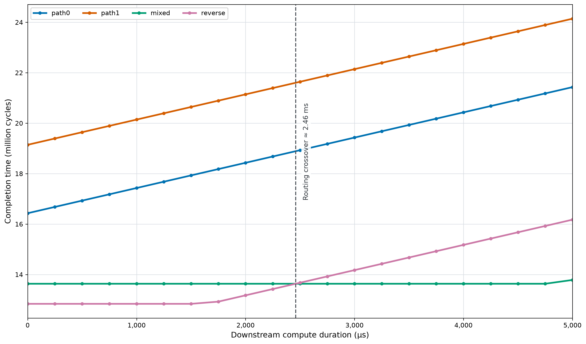

# exp1 实验总结：Routing 与下游计算时长

## 实验目的

本实验研究 Ring AllReduce 与 Direct All-to-All 的 routing 组合如何影响端到端完成时间，以及最优 routing 组合是否随下游计算时长变化。

性能指标为 8 个 rank 中最大的 Wall time，即一次实验的完成时间（simulator cycles，越低越好）。

## 实验设置

| case | Ring AllReduce | Direct All-to-All |
|---|---|---|
| `path0` | path 0（short） | path 0（short） |
| `path1` | path 1（long） | path 1（long） |
| `mixed` | path 0（short） | path 1（long） |
| `reverse` | path 1（long） | path 0（short） |

- Ring AllReduce 使用 ranks 0、1、4、5；其后连接本实验 sweep 的 compute 节点。
- Direct All-to-All 使用 ranks 2、3、6、7，与 Ring/compute 分支并行，最后通过 join 汇合。
- 通信数据量为每个 rank 64 MiB。
- 完整 sweep 包含 0–15,000 的 61 个采样点，步长为 250。
- 本总结及最终图聚焦 0–5,000 μs，共 21 个采样点。
- sweep 数值直接写入 Chakra `duration_micros`，因此目录中的数值与微秒一一对应。例如 `cycles_250` 表示 250 μs，而不是 250 个 simulator cycles。
- 输出 Wall time 仍采用 ASTRA-sim runtime log 报告的 simulator cycles。

## 汇总图



图中竖直虚线表示通过相邻采样点线性插值得到的 routing crossover，约为 2.46 ms。

## 关键结果

| 下游计算时长（μs） | path0 | path1 | mixed | reverse | 最快配置 |
|---:|---:|---:|---:|---:|---|
| 0 | 16,428,860 | 19,141,853 | 13,632,932 | 12,836,665 | `reverse` |
| 2,250 | 18,678,859 | 21,391,852 | 13,632,932 | 13,423,440 | `reverse` |
| 2,500 | 18,928,859 | 21,641,852 | 13,632,932 | 13,673,440 | `mixed` |
| 5,000 | 21,428,859 | 24,141,852 | 13,783,328 | 16,173,440 | `mixed` |

主要观察：

1. 在 0–5,000 μs 范围内，将两个 collective 分配到不同路径的 `mixed` 和 `reverse` 始终优于共用同一路径的 `path0` 和 `path1`。这表明避免两类通信共享同一路径的竞争比单纯选择较短路径更重要。
2. `reverse` 在 0–2,250 μs 的 10 个采样点上最快；`mixed` 在 2,500–5,000 μs 的 11 个采样点上最快。
3. 当下游计算为 0 μs 时，`reverse` 相比 `mixed` 将完成时间降低约 5.84%。
4. 当下游计算为 5,000 μs 时，`mixed` 相比 `reverse`、`path0` 和 `path1` 分别降低约 14.78%、35.68% 和 42.91%。
5. `reverse` 的完成时间在 0–1,500 μs 保持不变，从 1,750 μs 开始增长；`mixed` 在 0–4,750 μs 基本保持不变，到 5,000 μs 开始增长。这说明随着 compute duration 增大，决定 makespan 的关键分支发生了变化。

## Routing crossover

定义两种分路配置的差值：

```text
D(t) = T_mixed(t) - T_reverse(t)

D(2250 μs) = +209,492 cycles
D(2500 μs) =  -40,508 cycles
```

在相邻采样点之间进行线性插值：

```text
t_cross = 2250 + 250 × 209492 / (209492 + 40508)
        = 2459.492 μs
        ≈ 2.46 ms
```

因此，在当前配置下：

- 下游计算短于约 2.46 ms 时，`reverse` 更优。
- 下游计算长于约 2.46 ms 时，`mixed` 更优。

离散实验能够直接支持的结论是 crossover 位于 2.25–2.50 ms；2.46 ms 是线性插值估计值。如需更精确定位，应在该区间进行更细粒度 sweep。

## 结论

本实验说明 routing 选择应结合计算与通信的关键路径，而不能只依据单条物理路径的长短。对于当前 topology、通信量和 workload：低 compute duration 时，应让 Direct All-to-All 使用短路径（`reverse`）；compute duration 超过约 2.46 ms 后，应让 Ring AllReduce 及其下游 compute 分支使用短路径（`mixed`）。

该结论仅适用于本次配置。当前数据没有重复试验或误差条；若用于论文中的普遍性结论，还应改变消息大小、topology、并发模式和随机种子进行验证。

## 产物

- [PNG 汇总图](sweep_comparison_to_5000.png)
- [SVG 矢量图](sweep_comparison_to_5000.svg)
- [0–5,000 μs 数据](sweep_comparison_to_5000.csv)
- [完整 sweep 汇总](../../log/20260924_182231/sweep_summary.md)
- [原始实验目录](../../log/20260924_182231/)
